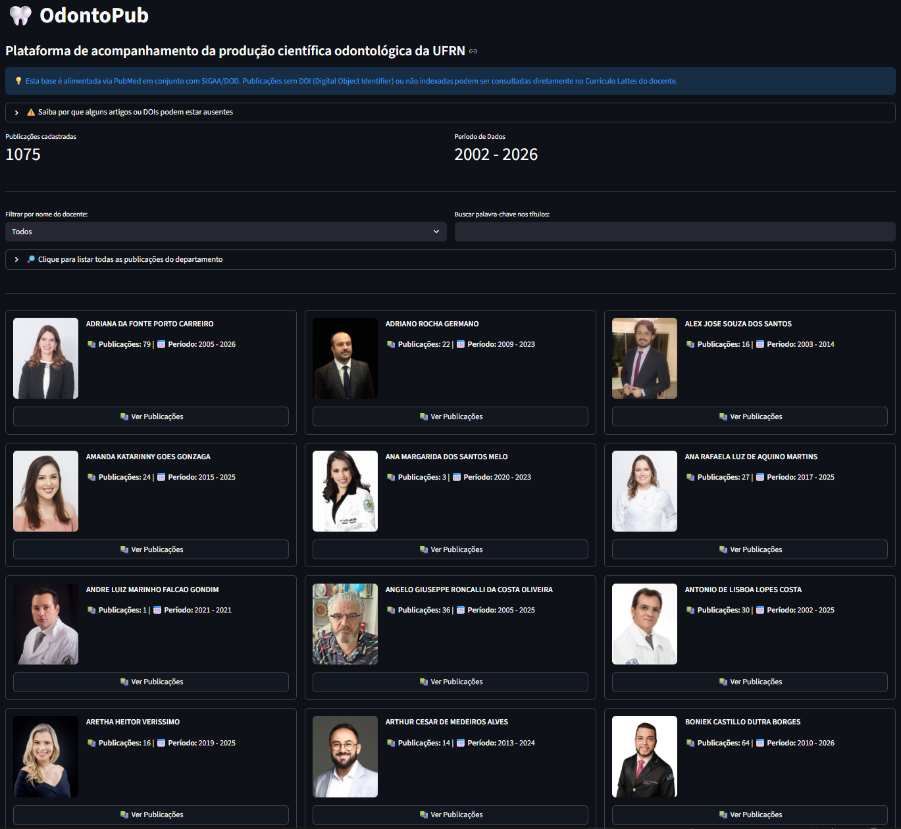

# 🦷 OdontoPub

O **OdontoPub** é um dashboard interativo desenvolvido em **Python** e **Streamlit** para centralizar, filtrar e visualizar a produção acadêmica dos docentes do Departamento de Odontologia da Universidade Federal do Rio Grande do Norte (UFRN), utilizando dados minerados diretamente da API do **PubMed (NCBI)** e **SIGAA/DOD**.



O objetivo é oferecer informações acessíveis aos alunos acerca da produção acadêmica de seus orientadores além de servir como meio de acompanhamento de publicações do corpo docente atual.


## Funcionalidades
- **Busca Automatizada**: Script de coleta que utiliza IDs e nomes para buscar publicações via Entrez/E-utils.
- **Vínculo Robusto**: Diferente de buscas genéricas, os artigos são vinculados diretamente ao docente responsável.
- **Filtros Avançados**: Filtragem por nome do professor, ano de publicação e palavras-chave nos títulos.
- **Acesso Direto**: Links integrados para DOI (Editora), PubMed e Currículo Lattes de cada docente.
- **Exportação**: Opção para baixar os dados filtrados em formato CSV.

## Tecnologias Utilizadas
- [Python 3.x](https://www.python.org/)
- [Streamlit](https://streamlit.io/) (Interface Web)
- [Pandas](https://pandas.pydata.org/) (Manipulação de Dados)
- [Requests](https://requests.readthedocs.io/) (Conexão com API NCBI)
- [Unicodedata](https://docs.python.org/3/library/unicodedata.html) (Normalização de strings)

## Estrutura do Projeto
- `app.py`: Código principal da aplicação Streamlit.
- `coletor_pubmed.py`: Script para minerar dados do PubMed.
- `professores.csv`: Base de dados dos docentes (Nomes e IDs Lattes).
- `publicacoes.csv`: Base de dados gerada com os metadados dos artigos.
- `requirements.txt`: Lista de dependências para o deploy.

## Como Executar

### 1. Pré-requisitos
Certifique-se de ter o Python instalado e as bibliotecas necessárias:
```bash
pip install -r requirements.txt
```

## 2. Coleta de Dados
Para atualizar a base de publicações, execute o coletor:

```bash
python coletor_pubmed.py
```
## 3. Executando o Dashboard
Para abrir a interface no seu navegador:

```bash
streamlit run app.py
```
## Notas sobre os Dados
A base de dados principal é alimentada pelo PubMed. É importante notar que:

**Publicações sem registro de DOI ou não indexadas no PubMed (como anais de eventos locais ou revistas regionais) podem não aparecer automaticamente**.

Nesses casos, recomenda-se a consulta direta ao Currículo Lattes do docente através dos links fornecidos na plataforma.

Desenvolvido para fins de gestão acadêmica e transparência científica.